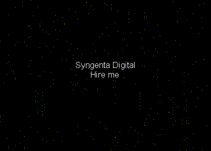

# Desafio técnico ~ Syngenta Digital

Os desafios consistiam na análise da imagem abaixo para descobrir a quantidade de pontinhos verdes e uma mensagem secreta!



## Primeira parte

Para resolver o problema dos pontinhos verdes a primeira coisa que fiz foi saber que tipo de arquivo continha a extensão **bmp**, então pesquisei alguns dias sobre o assunto e aqui vou deixar alguns dos vídeos que achei bem relevantes:

- [Oque são bitmaps?](https://www.youtube.com/watch?v=0KmimFoalTI&t=334s)
- [Como imagens são armazenadas?](https://www.youtube.com/watch?v=EXZWHumclx0)
- [Um pouco mais sobre como imagens são representadas digitalmente](https://www.youtube.com/watch?v=06OHflWNCOE)

Após ver esses vídeos e compreender o mínimo de bitmaps, parti para resolução do problema. Como opção para resolução, inicialmente pensei em fazer em Python, porém vi a oportunidade para aprender um pouco mais de NodeJs e resolvi fazer em JavaScript.

Explicando de forma rasa, utilizei das funções nativas do NodeJs para abrir o arquivo e fazer um stream de seus chunks para conferir byte por byte a ocorrência da cor verde, alguns artigos que me ajudaram no processo de codificar:

- [Oque são buffers?](https://nodejs.org/api/buffer.html)
- [Sobre números decimais e buffer](https://ddcode.net/2019/04/20/nodes-buffer-data-is-decimal/)
- [Sobre buffers e Streams](https://medium.com/developers-arena/streams-and-buffers-in-nodejs-30ff53edd50f)

Por final, a resposta de quantos pontos verdes a imagem possui é: **298**

### Executar o programa

Instale o [Node](https://nodejs.org/en/download/)

E execute o comando abaixo dentro do diretório do Desafio
```
node first_challenge.js
```

## Segunda Parte

Para o problema da mensagem secreta, a primeira coisa que pensei que poderia ser, seria a frase principal no meio da imagem
```
Syngenta Digital Hire me
```
Cheguei a mandar uma mensagem para o recrutador para conferir se está não era a frase secreta, adivinhem, claramente não era hahahah.

Como a solução para o problema realizei algumas pesquisas para entender como "coisas" são escondidas em imagens, vou deixar alguns vídeos e artigos que considero  interessantes sobre o assunto:

- [Oque é Esteganografia?](https://www.techtudo.com.br/noticias/noticia/2015/07/o-que-e-esteganografia.html#:~:text=Esteganografia%20%C3%A9%20uma%20t%C3%A9cnica%20que,do%20outro%2C%20de%20forma%20criptografada.)
- [Técnicas de esteganografia](https://blog.eccouncil.org/what-is-steganography-and-what-are-its-popular-techniques/)

### A primeira tentativa

Basicamente a ideia foi abrir a imagem como texto e procurar na manualmente se havia alguma mensagem escondida, porém não identifiquei nada que considerei como uma mensagem escondida


### A segunda tentativa

Basicamente minha segunda tentativa consistiu em editar a imagem para o espectro total verde, vermelho e azul para observar se havia alguma mensagem escondida em algum desses espectros, porém, também não considerei nada significante

### A terceira tentativa

Utilizando da ferramenta [HexIt](https://hexed.it/) analisei os hexadecimais gerados para talvez encontrar algum padrão, mas não encontrei nada relevante, analisei também a ocorrência de caracteres utilizando do histograma, porém, não encontrei nada que pudesse significar algum tipo de mensagem

### A quarta tentativa 

Utilizando da ferramenta [Stegonline](https://stegonline.georgeom.net/) tentei extrair alguma informação da imagem porém não obtive sucesso.

### A quinta tentativa

utilizando da ferramenta [Exiv2](https://exiv2.org/) tentei descobrir se havia algum  metadado interessante na imagem porém não encontrei nada que pudesse me levar a uma mensagem

### Conclusão sobre o segundo desafio

Ainda não encontrei a mensagem secreta, porém ainda quero tentar uma coisa, analisando os pontos da imagem um pouco distante, a disposição deles parece bastante com a escrita em Braille, penso então em separar a em blocos de 3x6 pixels cada parte da imagem e analisar se onde existe a ocorrência de pixels verdes, esse coincidem com algum caractere em Braille